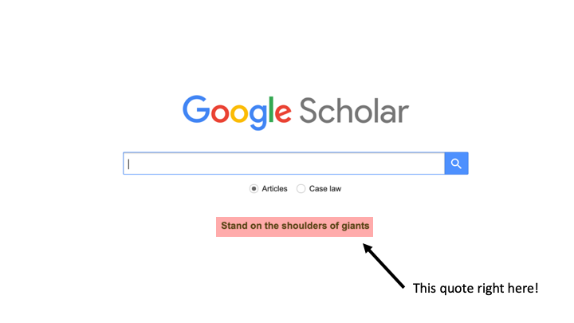
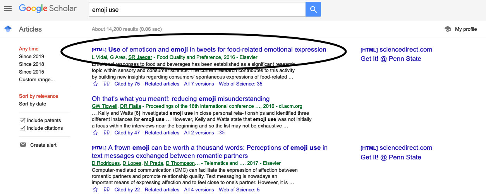
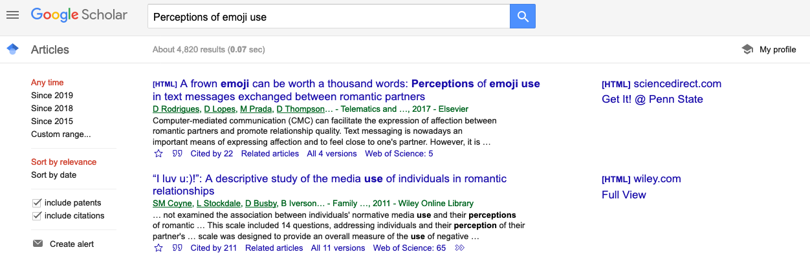
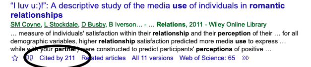
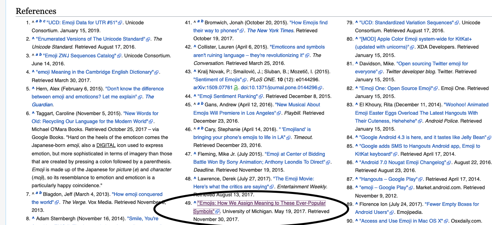

# The Proverbial "Research Topic"
I've written more research papers than I can remember in graduate school.
Writing them used to be a lot of work, but as I learned some tips and tricks it
became a lot easier, and even fun. I think about it as if I were a
detective trying to uncover specific topics. Here, I'll walk you through
my research process, and how I find information about a topic I am interested in.

First, you brainstorm a research question. Remember, your research question has to be
considered a true experiment with at least two manipulated variables with two levels
each. This is called a two-by-two experimental design.

Remember, you don't have to come up with a completely new idea. Perhaps you read an
interesting article and want to test the ideas presented in that article in a different
way, or extend them somehow. This is perfectly acceptable! In fact, this is how science
is built! Science slowly builds on previous work. This is so ingrained in the ideals of
science, take a look at the quote on the Google Scholar landing page:

"Stand on the shoulders of giants," or, base your work on what has been done before! Learn from it
to make your own better!

# Finding Information
OK, what to do once you have an idea. For illustrative purposes, I'm going to attempt to research
the topic of "perceptions of emoji use in romantic relationships."

## Beyond "PsycARTICLES"
PsycARTICLES is great, but it is run by the American Psychological Association (APA), and
thus only offers search capabilities for APA journals. I rarely ever use PsycARTICLES, and
instead opt to go straight to Google Scholar for most of my preliminary research.

## Google Scholar
The trick to a successful Google Scholar search is determining the appropriate language to use
in the search. For example, if I go too broad ("emoji use"), I get back research articles
that have nothing to do with my primary question.

Emoji use on food preference? Cool! But unrelated to my primary research question.

Similarly, if I go too narrow, I will miss a lot of related research that could help
inform my research topic. Here I start with a fairly broad search term.

And you can see that using this broad search term came up with what appears to be a highly relevant
article as the first hit!

After I find a few articles in this manner, I'll look at the "cited by" page to see who else is
citing these articles, and if they are at all related to my topic. I'll also see if any of the
researchers on the articles I found are on multiple articles. If so, I'll go to both their Google
Scholar page and their lab website to dig up more information.

### Google Scholar Tips and Tricks
  
  - Use the "time range" feature on the side panel to get current
  research! You don't want to be citing something from the 80's if
  more current research is available!
  
  - If you find a *really* good research article that is directly
  related to your topic, make sure to click the "cited by" link
  to see what other articles cite that one. Chances are that it
  is highly similar research, and can help you in your quest for
  more articles!
  

  
  - If you keep seeing an author name pop up in the articles you are reading,
  be sure to check their Google Scholar profile (by clicking their name), or
  visiting their lab website. Chances are that you can find additional and/or
  related work through either of these mechanisms.

## Is Wikipedia OK?
Despite what your grade school teacher has always said, Wikipedia is not inherently bad
when it comes to researching. In fact, it can be a good place to start your research
and get a primer on a specific topic.

What I find it most useful for is pointing me to additional sources of information. At the
end of each Wikipedia article is a [References](https://en.wikipedia.org/wiki/Emoji#References)
section. I searched for "Emoji" on Wikipedia and took a look at what the references were. I
found what looked to be a reputable source pointing to a University of Michigan study.

Following the link took me to a press release on a study examining why some Emojis are
more popular than others. The press release also links to the original research article,
which only adds to its credibility!

# Checklist for a GREAT Research Topic
Anyone can come up with a research topic that they would like to study,
or at least further investigate. However, what differentiates a "good" topic
from one that is "great"? In my mind (and I am grading you) there are several
qualifications that differentiate "good" from "great." So, before submitting
your topic make sure you ask yourself (and/or confirm) these statements:

  1. My research topic is definitely "testable." If you propose a study idea to
  "time travel" I'll think you are a super cool nerd, but I'll also fail you
  because I want your research to be feasible within the bounds or our reality
  and thus actually testable!
  
  2. My research topic is definitely "falsifiable." If you recall from the readings,
  a great research question is setup not in terms of what you expect, but what you
  would **not** expect (i.e., as if you were the most skeptical person ever).
  Therefore, you need to be able to state your research question in "falsifiable"
  terms!
  
  3. To my knowledge my research question has not been asked before, or if it
  has I am asking about a new facet about it, or in a new and imaginative way!
  in other words, "to my knowledge, has anyone asked this question before?"
  
  4. My research topic is grounded in pre-existing literature. Does your research
  question build upon previous work or ask something "out of the blue"? If the
  latter, it's probably wise to reconsider. I'd love to "Thanos" *Snap* gun
  violence out of existence, but that is just not feasible. Perhaps start smaller
  with a hypothesis such as "What is common among the top 5% of counties that see
  the most gun violence?"
  
  5. OK, this is digging deep, but ask yourself "have I cross-referenced
  my most pertinent research article with what has been cited in the article and
  in Wikipedia?" If not, do it! Do it now! You have to see what others are researching,
  especially the most recent of research!
  
  6. How will I test this question? Yes, it *is* testable, but how will you actually test
  it as a scientist? Make sure it conforms to the scientific method, and you would have
  the resources to test it (in reality)
  
  7. How will I analyze it? You might not know exactly the right test to analyze your
  results right now (e.g., t-test, ANOVA, linear model), but hopefully by the end of
  this course you will! At the very least, you can make sure that your research
  question is **NOT** correlation or descriptive. Make sure it is experimental, and
  at least a 2 by 2 experimental design
  
  8. Finally, ask yourself, "what impact does/could this research have on society at
  large?" Even if this is consider "basic" science, thinking about the ramifications of
  this research question can help you formulate a Discussion and "broader impact" section
  to your research paper!

