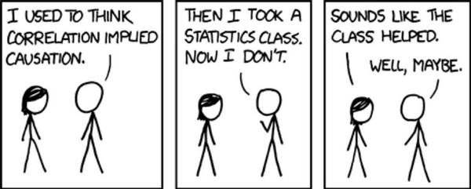

Welcome to the supplemental materials homepage for PSYCH 301, Section 005: Basic Research Methods in Psychology.

## Disclaimer
This **IS NOT** the official course website. Please refer to your [CANVAS](https://canvas.psu.edu) homepage for
the official website, core course materials, and grades.

## Instructor

Daniel Albohn \
463 Moore Building \
Department of Psychology \
dna5021@psu.edu

## About this site
It may not be completely obvious at the present why I will be using this website for some of the supplemental
material for the course, but I hope by the end of the semester you will have an appreciation for my decision to
do so. While there are several reasons, I'd like to focus on two: openness, and communication. This website, it's
materials, and source code are all freely available to view.

Second, like you will hopefully learn throughout the semester, effective communication is paramount to successful research.
It is not enough to conduct research, analyze the results, and call it quits. As scientists and researchers, we have an
obligation to effectively and succinctly report our findings to others. This website provides a suite of tools that will
help me do that for you.

