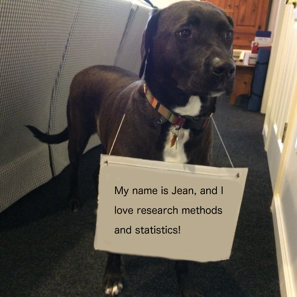

Hello everyone,

Welcome to PSYCH 301W, Basic Research Methods in Psychology. My name is Daniel Albohn (you can call me Dan, Professor Albohn,
Professor Dan, whatever you feel comfortable with) and I will be your instructor for the course. 

Before I get lost in research methods and statistics, let me tell you a little bit about myself. My professional expertise and
passion is social psychology, with an emphasis on person and face perception. I have over eight years of academic
research experience that spans fields as diverse as health psychology, clinical psychology, behavioral interventions,
human-animal bond, and person and emotion perception. Currently, my research focuses on utilizing computer vision and
machine learning to predict subtle facial expressions and expression resemblance and how to utilize such technology in
behavioral science.

When I am not working, I enjoy hiking and being outdoors and hanging out with my dog, Jean. Speaking of Jean, let me
introduce you to her:

<center>



</center>

And that's not "dog shaming" because I know for a fact she likes research methods. Jean is a rescue from a local
shelter and has severe social anxiety. I'll try and get her to make a few appearances over the course of the
semester, though.

I began my graduate career as a Clinical Psychology student, but quickly switched to Social Psychology after I had a
moment of clarity in which I realized I loved looking at data! I loved it so much that I would often dread going to
therapy sessions with clients in favor of sitting in my office and examining the ins and outs of the data I was
collecting.

Hopefully what will become clear as the semester progresses is that I am a big statistics and methods nerd.
I love both, and will jump on any excuse to do data analysis. One of the the reasons I decided to use this website as
a platform for the supplemental materials was effective communication. That is, some of the things I decide to share
with you are easily upload-able or can be created easily on this website. For example, let me show you what 
I mean by taking a look at some data now. Perhaps you want to quickly view how many students there presently are
in the class. I can quickly show you a graph.

```{r}
library(tidyverse)
data <- tibble(Teacher = 1,
               Students = 20,
               `Course Admins` = 2) %>% 
  gather()

ggplot(data, aes(x = key, y = value)) +
  geom_bar(stat = "identity") +
  theme_minimal() +
  labs(y = "Number of People",
       x = "Course Role")
```

With just a few lines of code, I can display data and text for your viewing pleasure that is both easily
digestible, and easy for me to produce. Of course, you are not responsible for knowing any of the code, this
is purely an exercise in presenting supplemental information to you. As time permits, I will be producing
reports on average grades (no identifying information), common mistakes, and additional commentary on things
I think should be highlighted for your learning.

That's it for now. If you have any questions, comments, or concerns, please do not hesitate to contact me either
through CANVAS or via my email dna5021@psu.edu.

Best regards,\
Dan
